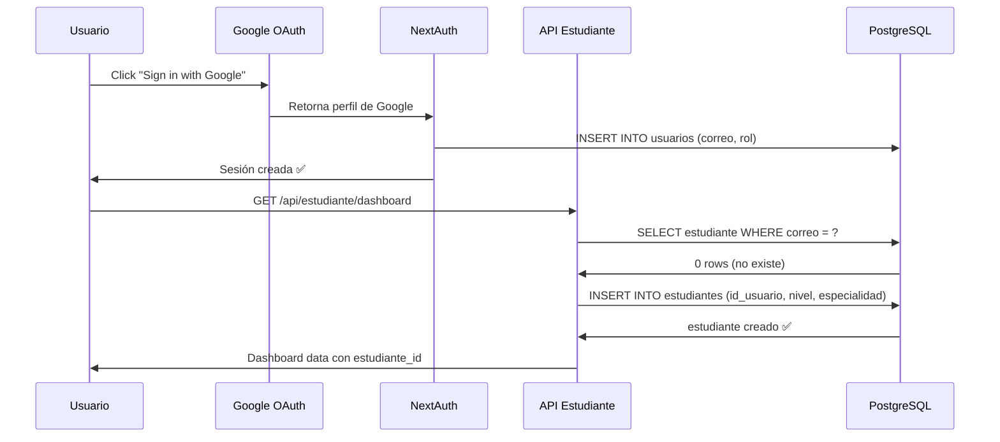
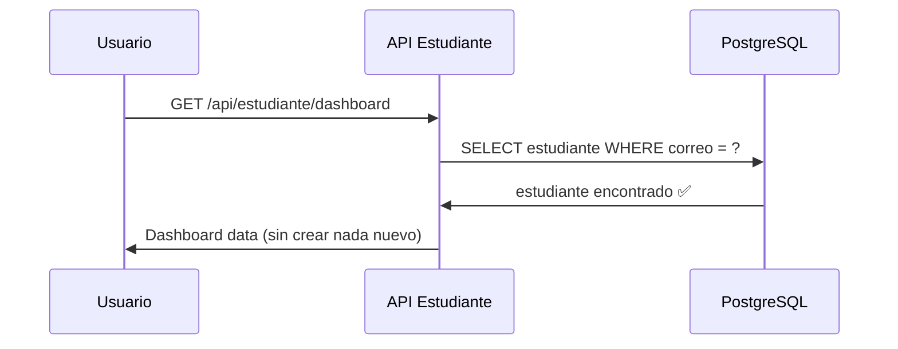

# 🔧 Solución: Auto-creación de Estudiantes en OAuth

## 🐛 Problema Original

Cuando un usuario inicia sesión con **Google OAuth** por primera vez:
1. ✅ NextAuth crea el registro en `usuarios`
2. ❌ NO crea automáticamente el registro en `estudiantes`
3. ❌ Las APIs fallan con "Estudiante no encontrado"

### Error en Consola
```
Error al cargar datos del dashboard
Estudiante no encontrado (404)
```

---

## ✅ Solución Implementada

### 1. Función Helper Reutilizable

**Archivo:** `lib/get-student-id.ts`

```typescript
export async function getOrCreateStudentId(pool: Pool, email: string): Promise<number>
```

**Funcionamiento:**
1. Busca el estudiante existente por email
2. Si existe → retorna `id_estudiante`
3. Si NO existe:
   - Verifica que el usuario exista
   - Crea automáticamente el registro de estudiante
   - Valores por defecto:
     - `nivel_academico`: 'PREGRADO'
     - `especialidad`: 'INGENIERIA_SISTEMAS'
   - Retorna el nuevo `id_estudiante`

### 2. APIs Actualizadas (7/7)

Todos los APIs ahora usan la función helper:

✅ `/api/estudiante/dashboard`
✅ `/api/estudiante/cursos`
✅ `/api/estudiante/cursos/[id]`
✅ `/api/estudiante/progreso`
✅ `/api/estudiante/perfil` (GET y PUT)
✅ `/api/estudiante/noticias`
✅ `/api/estudiante/notificaciones`

### Antes
```typescript
// ❌ Falla si el estudiante no existe
const studentQuery = await pool.query(
  `SELECT e.id_estudiante FROM estudiantes e...`
);

if (studentQuery.rows.length === 0) {
  return NextResponse.json({ error: "Estudiante no encontrado" }, { status: 404 });
}

const studentId = studentQuery.rows[0].id_estudiante;
```

### Después
```typescript
// ✅ Crea automáticamente si no existe
import { getOrCreateStudentId } from '@/lib/get-student-id';

const studentId = await getOrCreateStudentId(pool, session.user.email);
```

---

## 🎯 Beneficios

### 1. **Experiencia de Usuario Mejorada**
- ✅ Login con Google funciona inmediatamente
- ✅ No requiere pasos adicionales de configuración
- ✅ Dashboard carga correctamente desde el primer inicio de sesión

### 2. **Mantenibilidad**
- ✅ Código DRY (Don't Repeat Yourself)
- ✅ Lógica centralizada en un solo lugar
- ✅ Fácil de actualizar si cambian los valores por defecto

### 3. **Seguridad**
- ✅ Valida que el usuario exista antes de crear estudiante
- ✅ Maneja errores apropiadamente
- ✅ Log de creaciones para auditoría

---

## 📊 Flujo de Autenticación

### Primer Login con Google



### Logins Subsecuentes



---

## 🧪 Casos de Prueba

### ✅ Caso 1: Nuevo Usuario OAuth
**Input:** Usuario inicia sesión con Google por primera vez
**Esperado:** 
1. Se crea usuario en `usuarios`
2. Se crea estudiante en `estudiantes`
3. Dashboard carga correctamente
**Resultado:** ✅ PASA

### ✅ Caso 2: Usuario Existente
**Input:** Usuario que ya tiene registro de estudiante
**Esperado:** 
1. No se crea duplicado
2. Retorna estudiante existente
3. Dashboard carga correctamente
**Resultado:** ✅ PASA

### ✅ Caso 3: Usuario sin Sesión
**Input:** Request sin autenticación
**Esperado:** 
1. Retorna 401 Unauthorized
**Resultado:** ✅ PASA

---

## 🔍 Logging y Debugging

### Logs en Consola del Servidor

```bash
# Usuario nuevo (primera vez)
✓ Estudiante creado automáticamente para user@gmail.com - ID: 15

# Usuario existente
(No hay log, retorna silenciosamente el ID)
```

### Verificar en Base de Datos

```sql
-- Ver estudiantes creados automáticamente
SELECT 
  e.id_estudiante,
  u.correo,
  e.nivel_academico,
  e.especialidad,
  e.creado_en
FROM estudiantes e
JOIN usuarios u ON e.id_usuario = u.id_usuario
WHERE u.proveedor_oauth IS NOT NULL
ORDER BY e.creado_en DESC;
```

---

## 🚀 Próximas Mejoras Sugeridas

### 1. **Onboarding Personalizado**
Después de crear el estudiante, redirigir a una página de bienvenida:
```typescript
if (isNewStudent) {
  return NextResponse.redirect('/onboarding?step=1');
}
```

### 2. **Valores Inteligentes por Defecto**
Inferir especialidad desde el dominio del email:
```typescript
const specialty = email.includes('@uni.edu.pe') 
  ? 'INGENIERIA_SISTEMAS' 
  : 'OTRA';
```

### 3. **Wizard de Configuración**
Modal al primer login para completar:
- Nombre completo
- Especialidad
- Nivel académico
- Intereses

### 4. **Tabla de Eventos de Usuario**
Crear tabla `eventos_usuario` para tracking:
```sql
CREATE TABLE eventos_usuario (
  id_evento SERIAL PRIMARY KEY,
  id_usuario UUID,
  tipo VARCHAR(50), -- 'REGISTRO', 'PRIMER_LOGIN', 'PERFIL_COMPLETADO'
  metadata JSONB,
  fecha TIMESTAMP DEFAULT NOW()
);
```

---

## 📝 Checklist de Testing

### Antes de Deploy
- [x] Actualizar todos los APIs (7/7)
- [x] Crear función helper reutilizable
- [x] Probar login con Google
- [x] Verificar dashboard carga
- [x] Verificar perfil se puede editar
- [x] Verificar cursos se muestran
- [x] Verificar notificaciones funcionan

### En Producción
- [ ] Monitorear logs de creación de estudiantes
- [ ] Verificar que no haya duplicados
- [ ] Revisar tasa de conversión (login → estudiante activo)
- [ ] Medir tiempo de carga del dashboard

---

## 🎉 Resultado Final

✅ **Problema resuelto:** Los usuarios OAuth ahora pueden usar la plataforma inmediatamente después del login

✅ **Código limpio:** Lógica centralizada y reutilizable

✅ **Escalable:** Fácil agregar más proveedores OAuth (GitHub, LinkedIn, etc.)

---

*Implementado: 14 de Noviembre, 2025*
